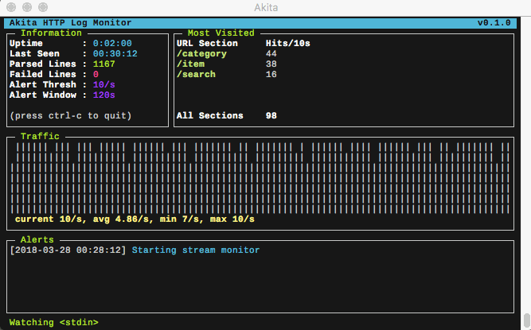

<a href="https://pypi.python.org/pypi/akita/">
  
</a>
<a href="https://pypi.python.org/pypi/akita/">
  
</a>
<a href="https://travis-ci.org/michael-lazar/Akita">
  
</a>

# Akita

<p align="center">

</p>

*Akita* is a local HTTP log monitoring tool that runs in your terminal. With Akita, you can view a summary of you webserver's activity in real-time. All server access logs that use the [Common Log Format](https://en.wikipedia.org/wiki/Common_Log_Format) are supported, including Apache and Nginx.

*Akita* is also a breed of dog originating from the mountainous northern regions of Japan. The Akita is courageous, a natural guardian of his family. Stubborn and willful, he won't back down from a challenge. [<sup>[0]</sup>](http://dogtime.com/dog-breeds/akita)

<p align="center">

</p>

## Installation

Akita is available on [PyPI](https://pypi.python.org/pypi/akita/) and can be installed using pip:

```bash
# Requires python 3!
$ pip install akita
```

Alternatively, you can clone the repository and run the code directly:

```bash
$ git clone https://github.com/michael-lazar/Akita.git
$ cd Akita
$ python -m akita
```

## Usage

Launch Akita by pointing it at the server access log file that you want to monitor:

```bash
$ akita /var/log/apache/access.log
```

You can also provide a stream via a unix pipe:

```bash
$ tail -n 1 -f /var/log/apache/access.log | akita -
```

If you want to try running Akita but you don't have a webserver to point it to, you can use the [apache-loggen](https://github.com/tamtam180/apache_log_gen) command line tool to generate fake log data.

```bash
$ gem install apache-loggen
$ apache-loggen --rate=10 | akita -
```

## Options

```bash
$ akita --help
usage: akita [--help] [--version] FILE

       / \      _-'
     _/|  \-''- _ /
__-' { |         \
    /             \
    /      "o.  |o }        Akita - Terminal HTTP Log Monitoring
    |            \ ;
                  ',
       \_         __\
         ''-_    \.//
           / '-____'
          /
        _'
      _-'

positional arguments:
  FILE                  A log file to watch, use "-" to pipe from stdin

optional arguments:
  -h, --help            show this help message and exit
  --alert-threshold ALERT_THRESHOLD
                        High traffic alert threshold, requests/second
  --alert-window ALERT_WINDOW
                        High traffic alert window, in seconds
  -V, --version         show program's version number and exit
```

## Testing

This repository is continuously tested on [TravisCI](https://travis-ci.org/michael-lazar/Akita), but you can also run the test suite locally:

```bash
$ git clone https://github.com/michael-lazar/Akita.git
$ cd Akita
$ pip install .[test]  # Installs pytest
$ env PYTHONPATH=. py.test -v
```

## License
This project is distributed under the [MIT](LICENSE) license.
